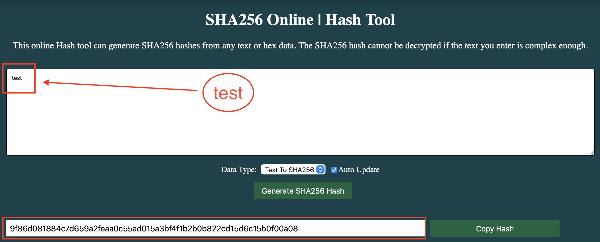

# Самостоятельная работа

> [!WARNING]
> Пока тут заглушка, тк трекинг задач платформы не сопровождал курс и поставил срок сдачи всех практических в 1 миг.
> Прошу понять и простить, я стараюсь активно наверстать весь материал курса и выполнить все задачи в срок.
> 

> [!NOTE]
> <ins>**Описание задачи:**</ins>
> Самостоятельно выполнить задание 3 сегодняшнего семинара с операционными системами, которые не были доступны студенту во время занятия.

```shell
❯ shasum -a 256 ./Урок\ 8.\ Основы\ криптографической\ защиты\ информации.md
0246b81faa28421dfac219124d3d71fa15f794c2bc8fed904543581902f33811  ./Урок 8. Основы криптографической защиты информации.md
```


```shell
❯ echo -n test | shasum -a 256
9f86d081884c7d659a2feaa0c55ad015a3bf4f1b2b0b822cd15d6c15b0f00a08
```



> [!NOTE]
>  <ins>**Дополнительное задание:**</ins>
> Напишите программу на Python, которая будет вычислять хэш-значения.
> 
